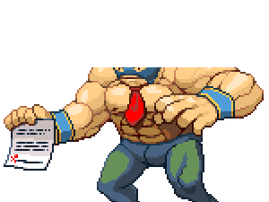
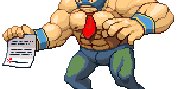

Demonstrates bug in gif encoder when an image with non- (0,0) bounds is saved.
See https://code.google.com/p/go/issues/detail?id=6635

Actual result from gif-crop.go:

Expected result from gif-grop.go:

Actual result from gif-crop-workaround.go:

